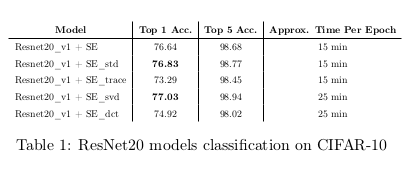
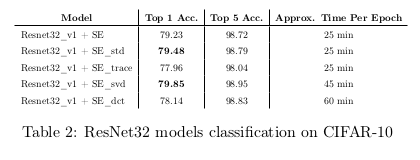

# Different Descriptors for Squeeze and Excitation Attention Block

External attention modules such as the Squeeze and Excitation (SENet) block, Efficient Channel Attention (ECA) block, Convolutional Block Attention Module (CBAM), etc. have been recently proposed for various
image related tasks. They have particularly exploit the channel wise information to improve overall accuracy of the network. In this work, different descriptors such as standard deviation, trace, largest singular value and DC term of discrete cosine transform (DCT) are used for extracting channel information instead of the usual global average. The experiments were tested on ResNet models of depth 20 and 32 with SENet using the CIFAR-10 dataset. The results showed that there is a slight increase in the accuracy of classification when standard deviation and largest singular value are used as channel descriptors with minimal increase in the training time. Find the full report here: [REPORT](Project_Report.pdf)

The results are shown below for ResNet20-v1 and Resnet32-v1:

### Original Code 
The code for this project is modified using this original repo: [Link](https://github.com/kobiso/CBAM-keras)
A token of thanks to the developer whose code helped me to successfully try out this project.

### My Code Implementations
I implemented a function: `other_transform()` which takes the input features and perform various statistic measures on it instead of the GlobalAvgPool2D. This function is defined in `utils.py` and called in `models/attention_module.py`.
More information on how to use this function is provided in docstrings in the respective code files.
The function is only made for the Squeeze and Excite Block and tested on the ResNet-v1 models. You can extend it to use at other places with correct modifications.

To know about how to run the files are mentioned in the original repo linked above. 

